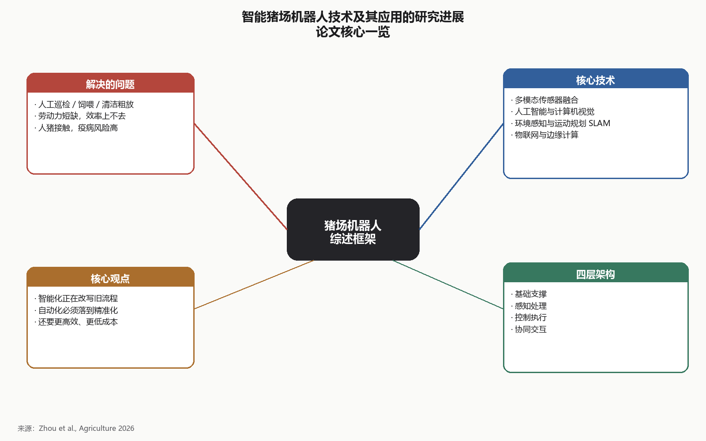
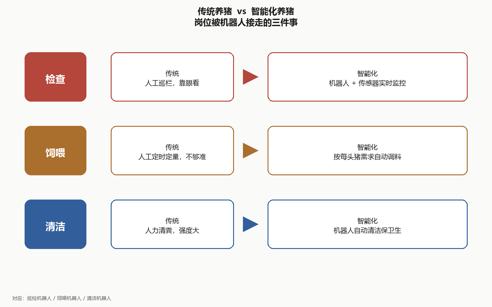
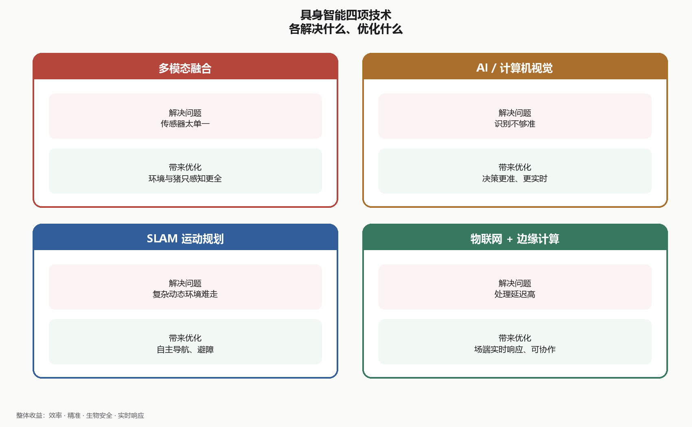
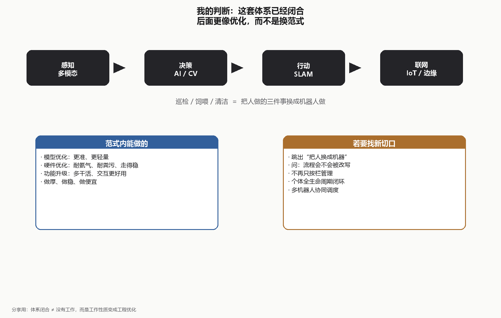

# 读书笔记：智能猪场机器人技术及其应用的研究进展

**文献**：Zhou L, Hao L, Xiong Y, et al. Research Progress of Robotic Technologies and Applications in Smart Pig Farms. *Agriculture*, 2026, 16(3): 334.  
DOI: [10.3390/agriculture16030334](https://doi.org/10.3390/agriculture16030334)

**分享用图**（可直接发聊天/贴 PPT）：
- [思维导图-01-论文核心.png](./思维导图-01-论文核心.png)
- [思维导图-02-传统对照智能化.png](./思维导图-02-传统对照智能化.png)
- [思维导图-03-四项技术.png](./思维导图-03-四项技术.png)
- [思维导图-04-我的判断.png](./思维导图-04-我的判断.png)

---

## 论文核心内容

### 解决的问题
- **传统养猪方式的局限性**：人工检查、手动饲喂和环境清洁效率低下，成本高且不够精准。
- **劳动力短缺**：养猪场面临劳动力不足的问题，影响生产效率和管理效果。
- **生物安全性**：人猪接触频繁增加了疾病传播的风险。

### 核心技术
1. **多模态传感器融合**：通过整合多种传感器提升猪场环境和猪只的感知能力。
2. **人工智能与计算机视觉**：利用深度学习算法进行环境信息的获取、分析和智能决策。
3. **环境感知与运动规划**：SLAM技术支持机器人在复杂环境中的自主导航。
4. **物联网与边缘计算**：实现低延迟的数据处理和智能控制，支持多机器人协作。

### 核心观点
- **智能化转型**：智能机器人技术在大型养猪场中改变了传统的养殖方式。
- **自动化与精准化**：通过机器人技术实现猪场管理的自动化和精准化，提高生产效率。
- **未来发展方向**：需要进一步技术突破以实现更高效、更低成本的智能化养猪方案。

---

## 我的思考与关注

### 对比传统与智能化养猪

- **人工检查 vs 自主检查**
  - 传统：依赖人力进行猪群健康和环境的日常检查。
  - 智能化：使用机器人和传感器进行实时监控和数据收集。

- **手动饲喂 vs 精准饲喂**
  - 传统：饲喂时间和数量由人工控制，可能不够精准。
  - 智能化：利用智能算法，根据每头猪的具体需求自动调整饲料的种类和数量。

- **环境清洁 vs 自动清洁**
  - 传统：主要依靠人力进行清理，耗时且劳动强度大。
  - 智能化：机器人自动执行清洁任务，保证环境卫生。

### 思考与启发
- **效率与成本**：智能化养猪显著提高了操作效率。初始投资较高，但长期可以降低劳动力成本和饲料浪费。
- **精准性与安全性**：智能机器人根据实时数据做决策，管理更准；同时减少人猪接触，降低疫病传播风险。

### 具身智能技术的应用与优化

1. **多模态传感器融合**
   - 解决问题：传统传感器单一，难以全面感知环境。
   - 带来优化：提高环境和猪只的感知能力，实现更精准的监控和数据收集。

2. **人工智能与计算机视觉**
   - 解决问题：传统方法对环境和猪只的识别不够准确。
   - 带来优化：增强图像处理和模式识别能力，提高决策的准确性和实时性。

3. **环境感知与运动规划（SLAM）**
   - 解决问题：传统导航方式难以应对复杂动态环境。
   - 带来优化：实现自主导航和最佳路径规划，避免障碍。

4. **物联网与边缘计算**
   - 解决问题：数据处理延迟高，难以实时响应。
   - 带来优化：降低数据处理延迟，实现实时监控和快速响应。

### 具身智能带来的整体优化
- **效率提升**：减少对人力的依赖，提高工作效率。
- **精准管理**：个性化饲喂和环境控制，减少浪费。
- **生物安全**：降低人猪接触，减少疾病传播风险。
- **实时响应**：快速数据处理和决策能力，及时应对变化。

### 改进与创新空间
- **模型与硬件优化**：引入更先进的算法和材料，提高系统性能和耐用性。
- **功能与用户体验升级**：增加智能功能和改进人机交互，提高用户满意度。
- **数据安全与隐私保护**：加强数据保护措施，确保信息安全。

### 我的判断

这套体系读起来很“自然而然”：感知（多模态）→ 决策（AI/CV）→ 行动（SLAM/运动规划）→ 联网（IoT/边缘计算），巡检、饲喂、清洁也对得上传统三件套。框架本身已经闭合，不像还缺一块关键能力。

在这个范式里，真正能动手的地方更像是：
- 模型优化（识别更准、更轻量）
- 硬件优化（耐氨气、耐粪污、走得稳）
- 功能升级（多干几件事、交互更好用）

也就是说，后续工作多半是**把现成架构做厚、做稳、做便宜**，而不是再发明一套新体系。若要找更新的切口，可能得跳出“把人做的三件事换成机器人做”，去问：机器人进场之后，养殖流程本身会不会被改写（例如不再按栏管理、个体全生命周期闭环、多机器人协同调度），而不是只把原岗位自动化。
