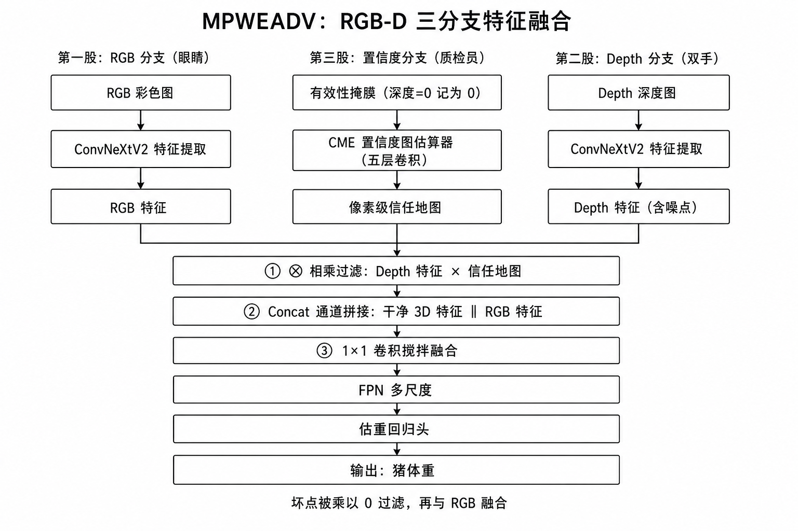
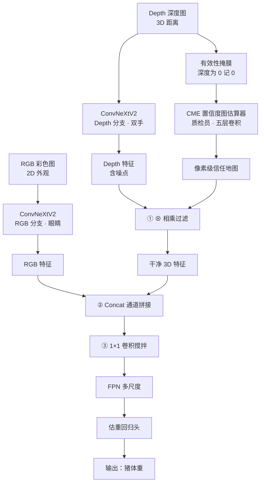

# 读书笔记：过道场景下基于 RGB-D 的生猪估重双流融合网络

**文献**：Tan Z, Liu J, Xiao D, Liu Y, Huang Y. Dual-Stream Fusion Network with ConvNeXtV2 for Pig Weight Estimation Using RGB-D Data in Aisles. *Animals*, 2023, 13(24): 3755.  
DOI: [10.3390/ani13243755](https://doi.org/10.3390/ani13243755)  
PDF：`animals-13-03755.pdf`

**一句话**：在过道里给走动的猪做非接触估重——RGB 看外观，深度图看体尺，用 ConvNeXtV2 双流融合（方法名 MPWEADV）。

---

## 核心观点与技术

### 问题背景
- **传统方法的局限性**：在养猪场中，准确估算猪的体重是一个挑战，尤其是在猪不断移动的动态环境中。传统称重方法受限于环境光线变化和猪的运动，难以实现实时、准确的体重估算。

### 技术创新
- **多模态融合**：结合 RGB（彩色）和深度（D）信息，通过双流融合网络提高估重准确性。
- **ConvNeXtV2**：用该网络做特征提取，增强对图像特征的学习能力。
- **自监督模块（FCMAE）**：进一步提高特征提取能力，服务估重精度。

### 解决方案
- **移动猪体重估算算法（MPWEADV）**：利用 RGB-D 数据，在动态环境中对走动的猪做实时估重。
- **特征融合模块**：通过信任度图估算器，把 RGB 和深度信息融合，提高估算精度。

### 实验结果
- 测试集 RMSE **4.082 kg**，MAPE **2.383%**，显示出优于对照方法的潜力。

### 解决的问题
- **实时性与准确性**：在不受限的环境中提供实时体重评估，支持养殖计划调整。
- **数据多样性与鲁棒性**：多模态融合提高模型在不同环境下的适应性和鲁棒性。

---

## 我的思考与关注

### 图像清晰度：我以为会做加权，论文选择了硬筛

阅读预处理流程时的假设：**系统会不会按图像清晰度，在训练时给不同样本不同“反馈权重”？**（清晰图权重大、模糊图权重小，让模型把注意力放在干净样本上。）这接近注意力机制处理噪声数据的路子。

对照原文 **2.1 Dataset Construction**，作者没有做动态加权，而是更直接的**门卫式数据清洗**：

1. **算模糊度**：用拉普拉斯算子评估清晰度（原文式 (1)）。图像看成二维函数 \(f(x,y)\)（像素灰度），拉普拉斯是 \(x\)、\(y\) 方向二阶导之和，对边缘和突变敏感：

$$
L(x,y)=\frac{\partial^{2} f(x,y)}{\partial x^{2}}+\frac{\partial^{2} f(x,y)}{\partial y^{2}}
$$

拉普拉斯对噪声也敏感，所以实际用的是 **\(L\) 的方差** 做模糊检测：方差大 → 边缘多 → 图更清晰；方差小 → 糊。

2. **Min-Max 归一化到 \([0,1]\)**（把上述方差缩放到可比较的分数，不是训练时的样本权重）：

$$
s=\frac{v-v_{\min}}{v_{\max}-v_{\min}}
$$

其中 \(v\) 为该图的拉普拉斯方差，\(v_{\min}\)、\(v_{\max}\) 为当前批次/数据集上的最小、最大值。

3. **设阈值直接丢**：\(s>0.8\) 才算清晰并保留，其余糊图直接剔除。

过道是无约束场景，猪一直在动，抓拍里必然有大量运动模糊。作者的逻辑是：与其让网络花算力啃糊图、甚至被模糊特征带偏，不如**进模型前先保证数据质量**。清完糊图后，再用 **SSIM** 把连续帧里长得太像的重复照片删掉，提高训练集的有效性和多样性。

- **论文做法**：拉普拉斯方差 → Min-Max 得到清晰度分数 \(s\) → 阈值 0.8 硬筛。\(s\) 只用来决定留不留，**没有**再乘进损失函数当样本权重。
- **可做的切口**：如果以后数据极少、图不能随便扔，可以把这个 \(s\) 当成最初想的**清晰度权重**乘进训练，不一定非走“丢掉”这一条。

### RGB-D 的本质：不是给人看的 3D

看融合时的直觉：这像另一种**不是给人看的 3D 相机**，把深浅特征提出来，把 2D 转成立体。

细节上要改一句：**RGB-D 不是“2D 转 3D”，而是天生自带 3D。**

- **RGB（彩色图）**：记录 2D 外观——颜色、纹理、边界。
- **D（深度图 Depth）**：3D 传感器直接测到的物理距离矩阵。人眼里是一张发糊的灰度图，对模型来说是精确的 3D 地形。

比喻：

- RGB = AI 的眼睛：看清轮廓和表面细节。
- Depth = AI 的双手：摸出体积、胖瘦和空间起伏。
- RGB-D 融合 = **边看边摸**。不靠人类视觉标准，直接用物理距离；光线差、猪身上有泥时，估重仍站得住。

### RGB-D 融合：为什么不能直接加，而要拧成三股绳

深度相机能摸出 3D，但猪场里反光、遮挡会弄出“黑洞”和噪点。如果 RGB 和 Depth **直接相加/硬拼**，这些坏掉的 3D 点会把估重带偏。

论文没有停在双流，而是做成**三股绳**：

- **第一股（RGB 分支 = 眼睛）**：2D 外观——颜色、纹理、边缘。
- **第二股（Depth 分支 = 双手）**：3D 体积和形状，里面还混着噪点。
- **第三股（置信度分支 = 质检员）**：核心。专门给深度图训一个**置信度图估算器（CME, Confidence Map Estimator）**，输出像素级“信任地图”：哪些深度像素可信（高权重），哪些是坏点（低权重或 0）。

特征融合模块（Feature Fusion Module）三步把绳子拧起来：

1. **相乘过滤**：深度特征 \(\times\) 信任地图。坏点被乘成 0，留下相对干净的 3D 特征。
2. **通道拼接（Concat）**：干净的 3D 特征与 RGB 特征在通道维并排拼上。
3. **\(1\times1\) 卷积**：当搅拌机，在像素级把并排特征揉到一起。

要点：模型不只在学特征，还在学**自己提取的深度可不可靠**。以后摄像头 + 雷达这类组合里，哪个传感器爱受干扰，就可以套“置信度图 + 乘法过滤”，让模型择优录取，抗干扰会好很多。

### 透过现象看本质：深度学习就是在拟合回归

剥开神经网络和特征融合，底层仍是图像到体重的映射，目标是拟合一个很复杂的非线性回归：

$$
Y = f(X)
$$

\(X\) 是 RGB-D（以及中间特征），\(Y\) 是体重。所谓三股绳、置信度地图，本质上是在给不同特征变量分配更合理的权重，让算出来的 \(Y\) 误差最小。

创新点要拆开看：

- **算法层面**：没有颠覆底层理论。ConvNeXtV2、FPN 都是现成积木，这篇是搭积木。
- **工程层面**：猪场里深度相机常测出离谱噪点。置信度分支（质检员）在学术上叫**不确定性估计**：给模型一点“自知之明”，脏数据来了就把那一块权重压到 0，避免坏点把整个回归方程带崩。这是对着真实痛点的工程方案，不是新的数学定理。

### FCMAE：解码器在“强行脑补”

ConvNeXtV2 的自监督预训练叫 **FCMAE**（全卷积掩码自编码器）。训练时随机挖掉输入图里 **60%** 的 \(32\times32\) 块，编码器只看剩下的可见像素（稀疏卷积，避免偷看被遮区域）。

接下来，把提出来的特征和那些**黑块（掩码令牌, mask tokens）**一起交给解码器。解码器是轻量 ConvNeXt block，任务就是：凭没被遮的 40%，把那 60% 被盖住的猪身子重新画出来（重建图像）。损失用重建图和原图的 **MSE**，而且**只算在被遮住的块上**。

所以预训练不是直接学“这头猪多重”，而是逼编码器把猪的结构记住，解码器才能脑补出被挖掉的部分。骨干提特征提得更稳，后面估重才吃得上。

### FCMAE 的障眼法：画出来只是手段

“看 40% 猜 60%”在学术上叫**代理任务（pretext task）**。研究人员并不在乎解码器最后画出的猪好不好看。要求画出来，只是为了有一个可算的监督信号（像素 MSE），**倒逼编码器**从局部碎片里抽出高度浓缩的完整结构特征（潜变量）。

预训练一结束，负责画图的解码器会被扔掉（卸磨杀驴），只留下已经被练敏锐的**编码器**去做后面的体重回归。

像素级重建有一个浪费：模型可能把力气花在还原泥巴、水渍、地面阴影上，这些对估重几乎没用。

**可试的切口：用关键点约束替代像素重建。** 不要让模型去还原 60% 的像素，而是只看 40% 时，去预测被遮部位的关键点坐标（鼻尖、耳根、尾根、四肢关节等）。理由：

1. 体长、体高、胸围这类决定体重的量，主要由几何拓扑决定。
2. 注意力会被按到体型比例上，泥巴和光影不容易掺进来。
3. 提的特征跟体重更对齐，回归上限可能更高。

这篇已经在用五个关键点（头、颈、背、臀、尾）判断猪图全不全，但那是**数据清洗**，不是预训练的代理任务。若往下做，题目可以收成：**基于关键点掩码预测的无约束 RGB-D 猪重估算**。要注意：像素重建不需要额外标注；改成预测关键点，要么人工标，要么用现成关键点检测当伪标签。
